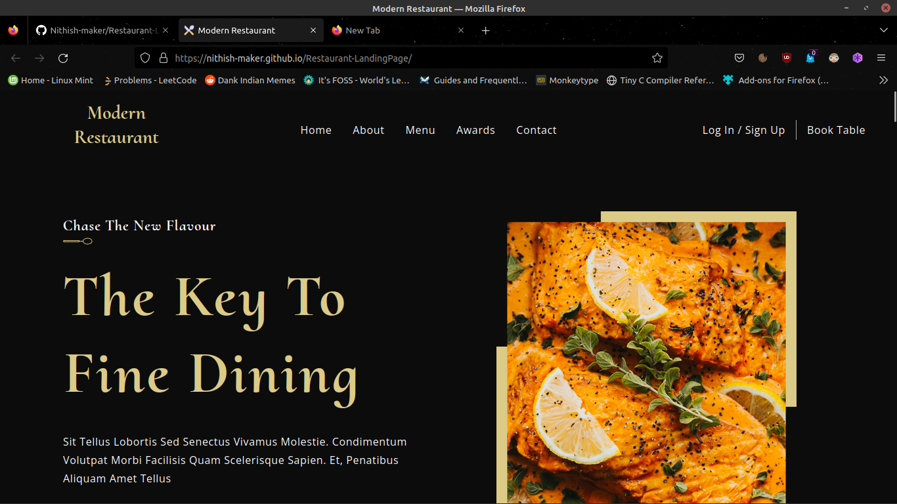
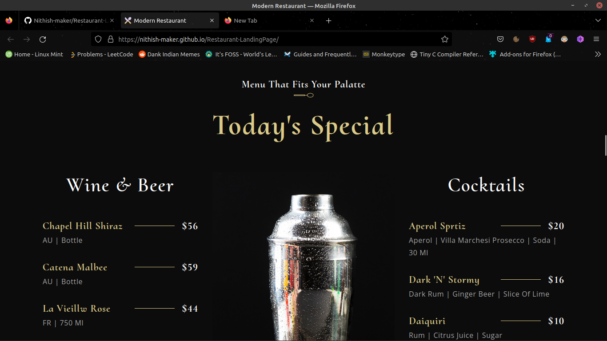
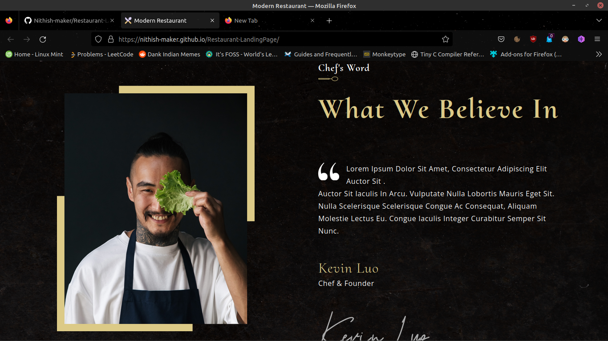
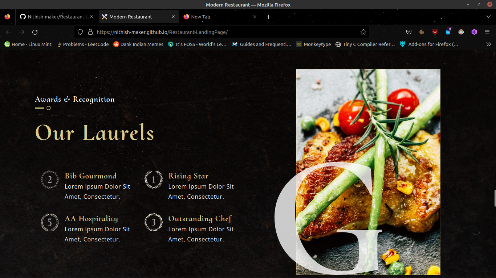

# Restaurant-LandingPage 🚀
```
A Modern Restuarant Landing Page built using ReactJs
```
# [Live Site](https://nithish-maker.github.io/Restaurant-LandingPage/) :rocket:

## ScreenShots









## Installation 🖥️

1. Clone the repo using
```
git clone repo_url
```
> NOTE : This repo will be cloned in your current working directory   

2. Install the dependencies and packages required for this project as 
```
yarn install
```

3. Then to run the application simply use
```
yarn start
```
